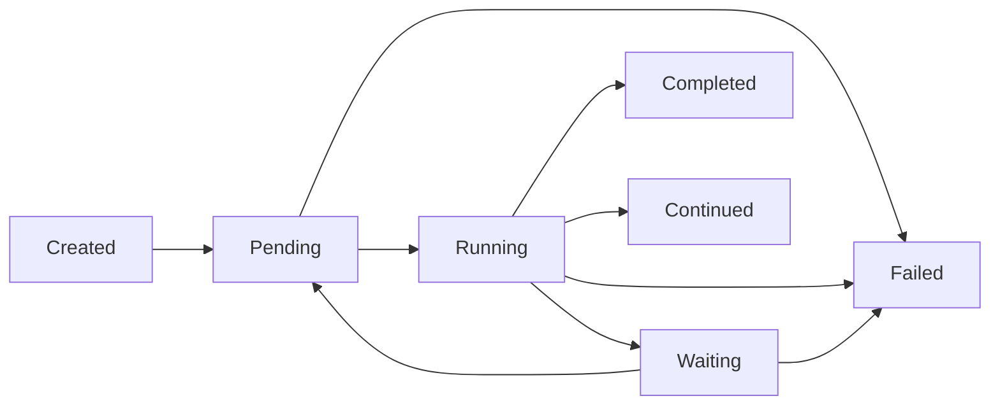

## Overview

Durable Workflow uses a state machine to manage workflow execution. Each workflow progresses through a series of states from creation to completion (or failure). Understanding these states is essential for monitoring and debugging workflows.

## Workflow States

Workflows can be in one of six states:

<Steps>
  <Step title="Created">
    The workflow has been instantiated but not yet started. This is the initial state after calling `WorkflowStub::make()`.
  </Step>
  
  <Step title="Pending">
    The workflow has been dispatched to the queue and is waiting to be processed by a worker.
  </Step>
  
  <Step title="Running">
    The workflow is actively executing its `execute()` method.
  </Step>
  
  <Step title="Waiting">
    The workflow has yielded an activity or timer and is waiting for it to complete.
  </Step>
  
  <Step title="Completed">
    The workflow has finished successfully and returned a value.
  </Step>
  
  <Step title="Failed">
    The workflow encountered an unrecoverable error.
  </Step>
</Steps>

There's also a special `Continued` state for workflows that use the continuation feature.

## State Classes

Each state is represented by a class that extends `WorkflowStatus`:

```php src/States/WorkflowCreatedStatus.php
final class WorkflowCreatedStatus extends WorkflowStatus
{
    public static string $name = 'created';
}
```

```php src/States/WorkflowPendingStatus.php
final class WorkflowPendingStatus extends WorkflowStatus
{
    public static string $name = 'pending';
}
```

```php src/States/WorkflowRunningStatus.php
final class WorkflowRunningStatus extends WorkflowStatus
{
    public static string $name = 'running';
}
```

```php src/States/WorkflowWaitingStatus.php
final class WorkflowWaitingStatus extends WorkflowStatus
{
    public static string $name = 'waiting';
}
```

```php src/States/WorkflowCompletedStatus.php
final class WorkflowCompletedStatus extends WorkflowStatus
{
    public static string $name = 'completed';
}
```

```php src/States/WorkflowFailedStatus.php
final class WorkflowFailedStatus extends WorkflowStatus
{
    public static string $name = 'failed';
}
```

## State Transitions

The `WorkflowStatus` base class defines which transitions are allowed:

```php src/States/WorkflowStatus.php
abstract class WorkflowStatus extends State
{
    public static function config(): StateConfig
    {
        return parent::config()
            ->default(WorkflowCreatedStatus::class)
            ->allowTransition(WorkflowCreatedStatus::class, WorkflowPendingStatus::class)
            ->allowTransition(WorkflowPendingStatus::class, WorkflowFailedStatus::class)
            ->allowTransition(WorkflowPendingStatus::class, WorkflowRunningStatus::class)
            ->allowTransition(WorkflowRunningStatus::class, WorkflowCompletedStatus::class)
            ->allowTransition(WorkflowRunningStatus::class, WorkflowContinuedStatus::class)
            ->allowTransition(WorkflowRunningStatus::class, WorkflowFailedStatus::class)
            ->allowTransition(WorkflowRunningStatus::class, WorkflowWaitingStatus::class)
            ->allowTransition(WorkflowWaitingStatus::class, WorkflowFailedStatus::class)
            ->allowTransition(WorkflowWaitingStatus::class, WorkflowPendingStatus::class);
    }
}
```

### Valid Transitions

Here are the allowed state transitions:



<Note>
  Invalid transitions throw a `TransitionNotFound` exception. This prevents workflows from entering inconsistent states.
</Note>

## Performing State Transitions

State transitions are performed using the `transitionTo()` method:

```php src/State.php
public function transitionTo($newState, ...$transitionArgs)
{
    $newState = $this->resolveStateObject($newState);
    
    $from = static::getMorphClass();
    $to = $newState::getMorphClass();
    
    if (! $this->stateConfig->isTransitionAllowed($from, $to)) {
        throw TransitionNotFound::make($from, $to, $this->model::class);
    }
    
    $this->model->{$this->field} = $newState;
    $this->model->save();
    $model = $this->model;
    $currentState = $model->{$this->field} ?? null;
    
    if ($currentState instanceof self) {
        $currentState->setField($this->field);
    }
    
    event(new StateChanged(
        $this,
        $currentState instanceof self ? $currentState : null,
        $this->model,
        $this->field
    ));
    
    return $model;
}
```

When a transition occurs:
1. The new state is validated
2. The model is updated and saved
3. A `StateChanged` event is dispatched

## State Transitions in Workflow Execution

### Starting a Workflow

When you call `start()`, the workflow transitions from `created` to `pending`:

```php
$workflow = WorkflowStub::make(MyWorkflow::class);
// Status: WorkflowCreatedStatus

$workflow->start($arg1, $arg2);
// Status: WorkflowPendingStatus (dispatched to queue)
```

### Running a Workflow

When the queue worker picks up the workflow, it transitions to `running`:

```php src/Workflow.php
public function handle(): void
{
    // ...
    try {
        if (! $this->replaying) {
            $this->storedWorkflow->status->transitionTo(WorkflowRunningStatus::class);
        }
    } catch (TransitionNotFound) {
        if ($this->storedWorkflow->toWorkflow()->running()) {
            $this->release();
        }
        return;
    }
    // ...
}
```

### Waiting for Activities

When the workflow yields an activity, it transitions to `waiting`:

```php src/Workflow.php
if (! $resolved) {
    if (! $this->replaying) {
        $this->storedWorkflow->status->transitionTo(WorkflowWaitingStatus::class);
    }
    return;
}
```

### Completing a Workflow

When the workflow finishes, it transitions to `completed`:

```php src/Workflow.php
if (! $this->replaying) {
    try {
        $return = $this->coroutine->getReturn();
    } catch (Throwable $th) {
        throw new Exception('Workflow failed.', 0, $th);
    }
    
    if ($return instanceof ContinuedWorkflow) {
        $this->storedWorkflow->status->transitionTo(WorkflowContinuedStatus::class);
        return;
    }
    
    $this->storedWorkflow->output = Serializer::serialize($return);
    $this->storedWorkflow->status->transitionTo(WorkflowCompletedStatus::class);
    
    WorkflowCompleted::dispatch(
        $this->storedWorkflow->id,
        json_encode($return),
        now()->format('Y-m-d\TH:i:s.u\Z')
    );
}
```

### Failing a Workflow

When an error occurs, the workflow transitions to `failed`:

```php src/Workflow.php
public function failed(Throwable $throwable): void
{
    try {
        $this->storedWorkflow->toWorkflow()->fail($throwable);
    } catch (TransitionNotFound) {
        return;
    }
}
```

## Checking Workflow State

You can check a workflow's current state using the `WorkflowStub`:

```php
$workflow = WorkflowStub::load($workflowId);

if ($workflow->created()) {
    echo "Workflow hasn't started yet";
}

if ($workflow->running()) {
    echo "Workflow is executing";
}

if ($workflow->completed()) {
    echo "Workflow finished: " . json_encode($workflow->output());
}

if ($workflow->failed()) {
    echo "Workflow encountered an error";
    foreach ($workflow->exceptions() as $exception) {
        echo $exception->exception;
    }
}
```

## State Storage

Workflow states are stored in the `workflows` table using the `status` column. The `StoredWorkflow` model uses a custom caster:

```php src/Models/StoredWorkflow.php
protected $casts = [
    'status' => WorkflowStatus::class,
];
```

The status is stored as a string (e.g., "created", "pending", "running") but cast to the appropriate state class when accessed.

## State Events

When a state changes, a `StateChanged` event is dispatched. You can listen to this event for monitoring:

```php
use Workflow\Events\StateChanged;

Event::listen(StateChanged::class, function ($event) {
    Log::info('Workflow state changed', [
        'workflow_id' => $event->model->id,
        'from' => $event->oldState::class,
        'to' => $event->newState::class,
    ]);
});
```

## Replaying and State

During replay, state transitions are skipped:

```php src/Workflow.php
if (! $this->replaying) {
    $this->storedWorkflow->status->transitionTo(WorkflowRunningStatus::class);
}
```

This prevents duplicate state transitions when reconstructing workflow state from history.

## Best Practices

<AccordionGroup>
  <Accordion title="Always check state before operations">
    Before calling methods like `output()` or `start()`, verify the workflow is in the correct state.
  </Accordion>
  
  <Accordion title="Handle transition exceptions">
    Wrap state transitions in try-catch blocks to gracefully handle invalid transitions.
  </Accordion>
  
  <Accordion title="Monitor state changes">
    Listen to `StateChanged` events for observability and debugging.
  </Accordion>
  
  <Accordion title="Use status helpers">
    Use `completed()`, `failed()`, `running()` instead of comparing status classes directly.
  </Accordion>
</AccordionGroup>

## Next Steps

<CardGroup cols={2}>
  <Card title="Durability" icon="shield" href="/concepts/durability">
    Learn how state is persisted and replayed
  </Card>
  <Card title="WorkflowStub" icon="wand-magic-sparkles" href="/concepts/workflow-stub">
    Master workflow interaction methods
  </Card>
</CardGroup>